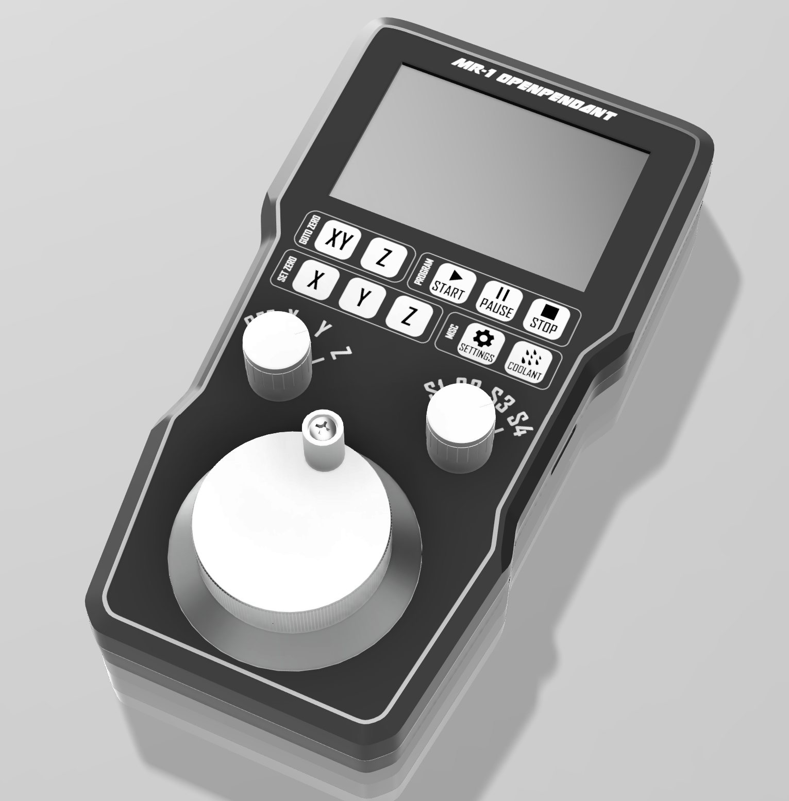
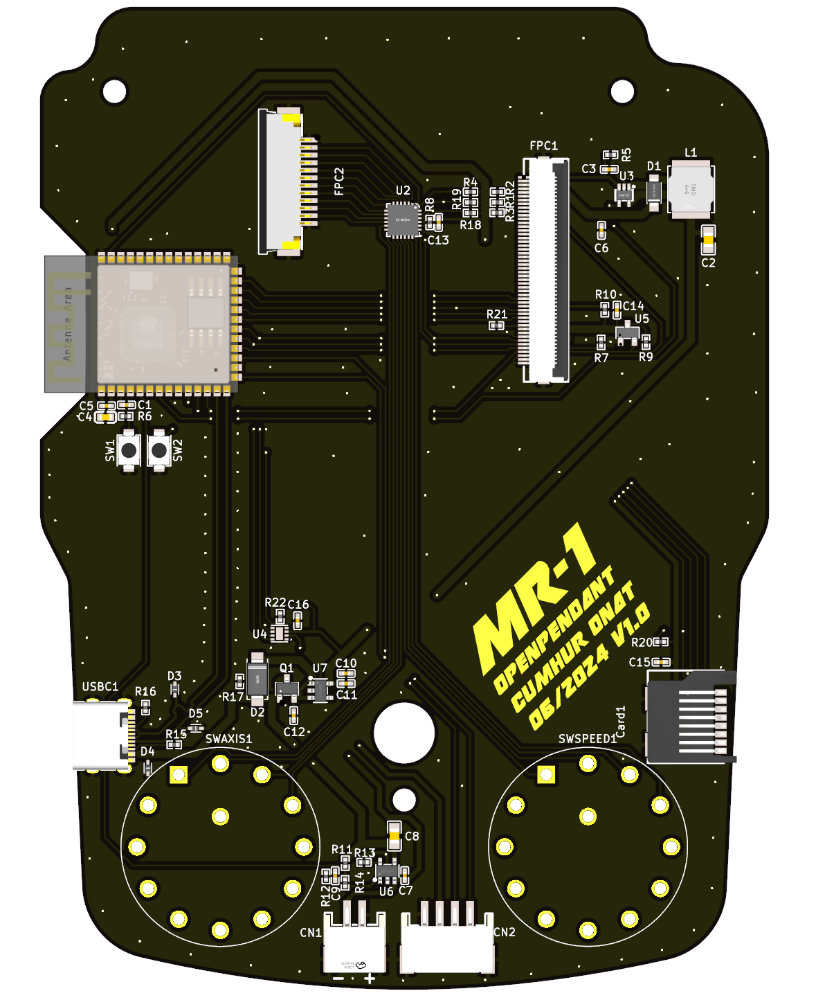
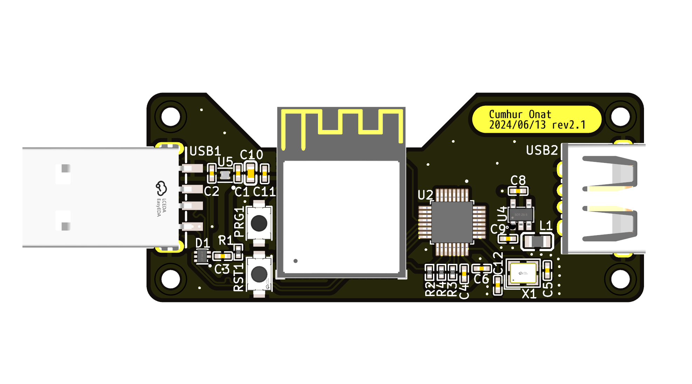
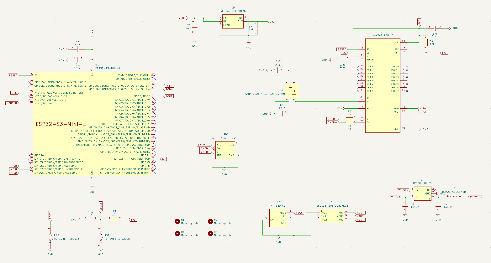

# mr-1-openpendant
An opensource pendant project for MR-1 CNC

## Overview
This project implements an open-source pendant system for the MR-1 CNC machine, providing a user-friendly interface for machine control and monitoring.
The system consists of two main components and detailed documentation for them can be found within their respective submodules.

### Pendant
- Custom-designed handheld controller
- Features a display interface for machine status and control
- Built using ESP32-based hardware
- Includes software implementation for the user interface and control logic

### Dongle
- USB interface for CNC machine communication
- Components:
  - PCB design files
  - 3D-printable enclosure
  - Arduino-based firmware using TinyUSB
  - Interface software

## Project Structure
- `/pendant` - Main pendant implementation
  - `/software` - Pendant firmware and interface code
- `/dongle` - USB interface dongle
  - `/enclosure` - 3D design files for the dongle case
  - `/pcb` - PCB design files
  - `/software` - Interface software

## Development Status
This project is currently under active development as part of the IMGD 5100 course final project.

## Acknowledgments
Special thanks to [Charlie Roberts](https://github.com/charlieroberts) for allowing this project to be developed as part of the IMGD 5100 final project.

## License
This project is open source and available under the[MIT License](https://opensource.org/licenses/MIT).
